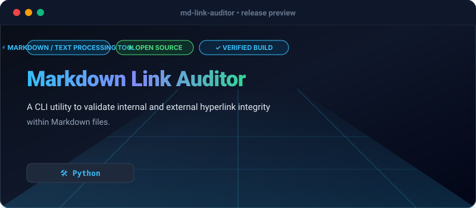

# Markdown Link Auditor

[](https://github.com/Olamideakinade/md-link-auditor)
[](https://opensource.org/licenses/MIT)



A command-line utility to verify the validity of links within Markdown files. It checks for broken relative paths and performs HTTP requests on absolute URLs to confirm reachability.

## Capabilities
- Recursive directory scanning for `.md` files
- Multithreaded concurrent verification
- Export reports in JSON and JUnit XML formats
- Configurable timeout and ignore patterns via CLI flags

## Installation & Usage

```bash
pip install requests
python main.py /path/to/docs --workers 20 --json-output report.json
```
